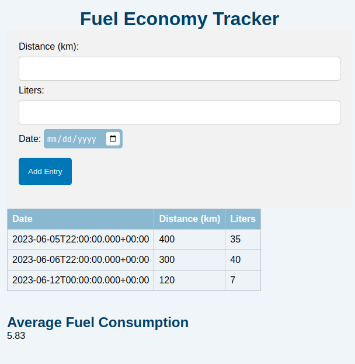

# Spring Boot Fuel economy tracker app
Simple fuel tracking app written in Spring Boot and vanilla JS.



## Description
This app allows you to view your average fuel consumption each time you fill up. When refueling, calculate the distance traveled, write down the number of liters refueled and enter the date of refueling. On the page it is possible to preview all refueling records, as well as to preview the last average fueling.

## Requirements
- PostgreSQL
- Java 

## Prepare the database
1. Install PostgreSQL
2. Login as postgres user to configure postgreSQL database:
```bash
psql -U postgres
```
3. Create the database:
```sql
CREATE DATABASE fuel_tracker;
```

4. Create the table:
```sql
CREATE TABLE fuel_entries (
id SERIAL PRIMARY KEY,
distance DOUBLE PRECISION,
liters DOUBLE PRECISION,
date DATE
);
```

## Run
1. Start the Spring backend:
```bash
java -jar fueltracker-0.0.1-SNAPSHOT.jar
```
2. Run the frontend by opening in browser index.html file located in `fuel-economy-tracker-frontend` directory.
3. Add entries

## License
This project is licensed under the [MIT License](LICENSE). See the `LICENSE` file for more details.
